```{r setup, include=FALSE}
knitr::opts_chunk$set(echo = TRUE)
```

```{r echo=FALSE, out.width=400}
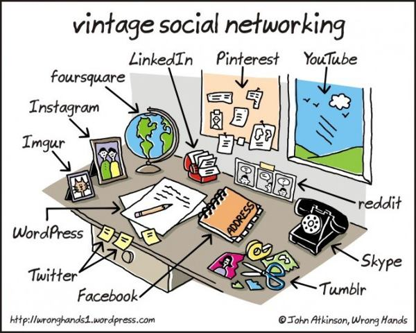
```


## Social media analyics and research

*Social media analytics* refers to collecting, processing and analysing social media data and covers various social media platforms that exist today. 

SMA is a vibrant area of practice and research with enormous practical tilt, professional interest and industry involvement.  67% of business plan to increase their spending on SMA in 2018-2019, however, currently only 45% of businesses believe that their social media efforts would provide effective support for their businesses (Buffer, 2018). 

```{r echo=FALSE}
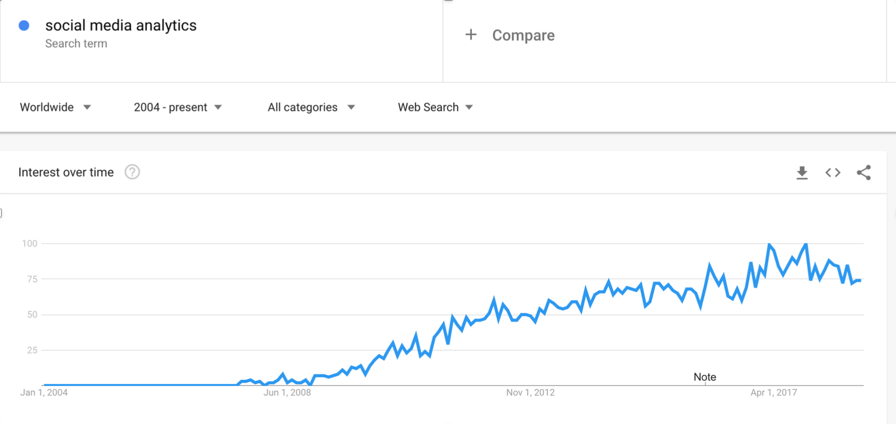
```

[Social Media Marketing Survey 2018](https://www.netbase.com/blog/global-social-media-report/) conducted by NetBase (NetBase, 2018) over 700 businesses in US and Canada showed that businesses use SMA for community management and engagement (72.36%), informing campaign strategy (63.89%), improving customer care (41.25%) and tracking crises in real-time (25.14%). 

Challenges:

+ constrantly **changing technical side** (APIs)

+ **new types of content** (e.g. ephemeral content = SnapChat, Instragram stories). 

“Ephemeral” content, i.e. the content that exists on the platform only a short period of time and cannot be saved, creates both advantages and drawbacks for SMA solutions. While the nature of the content appeals with its exclusivity and promotes engagement with the target audience (e.g. *Fear of Missing Out* - FOMO), its analysis is challenging due to short-lived nature of this node.

<iframe width="560" height="315" src="https://www.youtube.com/embed/Z-xO-_SvW8w?rel=0" frameborder="0" allowfullscreen></iframe>

Example of ephemeral content marketing: the release of Adele’s album, “25”, in 2015 - a 30-second clip of “Hello”. Three days later Adele announced that after three years she was about to release her third studio album, entitled simply, “25”.

+ **ethics and data privacy**

    +  Consent in social media: informed consent in an environment that promotes socially mediated and co-constructed texts
    
    + Traceability: the loss of confidentiality. How can we de-identify participation in an increasingly networked, pervasive and ultimately searchable ‘dataverse’?
    
    +  Recognising and responding to illicit or reportable activity

In the meantime, the popularity of social media analytics in business research is growing

```{r echo=FALSE, out.width=500 }
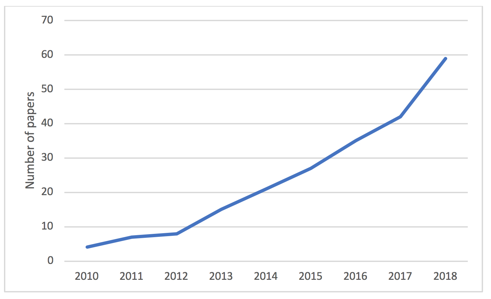
```

The analysis of the papers allowed to identify the following major topics (through their various themes) in social media analytics application

```{r echo=FALSE}
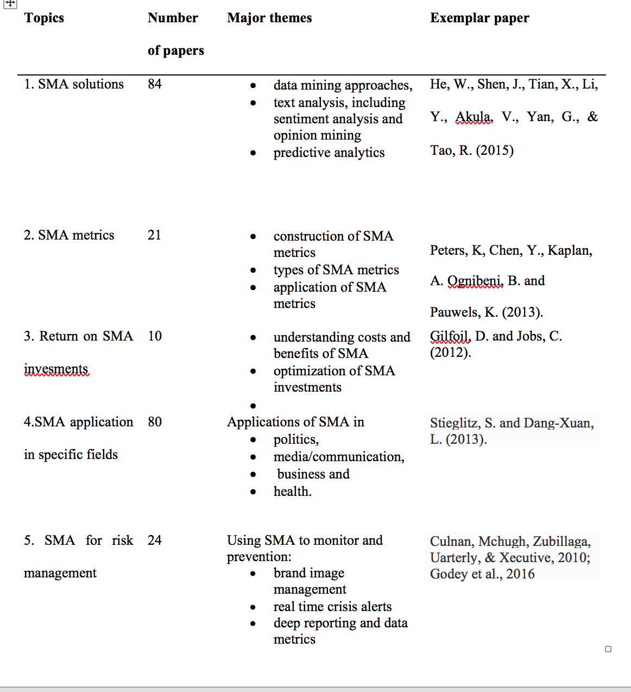
```


## Social media and API

Social media data structure:

+ **nodes** — individual objects (e.g. a User, a Photo, a Page, or a Comment)
used to get data about a specific object, accessed by a unique ID (e.g. official Facebook Page has the ID 20531316728)

+ **edges** — connections between a collection of objects and a single object (e.g. Photos on a Page, Comments on a Photo) used to get collections of objects on a single object, accessed by node ID and the edge name

+ **fields** — data about an object (e.g. User's birthday, Page's name) Used to get data about a single object or each object in a collection.


```{r echo=FALSE, out.width=300}
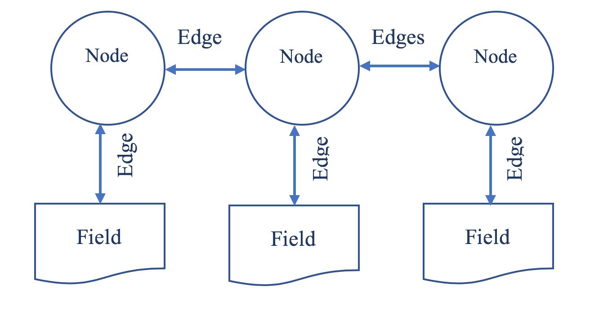
```

API and http:

+ **REST API**: read/modify a user's account: HTTP request (e.g. GET, POST, PUT, PATCH, DELETE) to  communicate between client and server (e.g. Authorization, Accept, Content-Type).

+ **Streaming API**: read data to deliver in real-time.

**API endpoint**: one end of a communication channel. When an API interacts with another system, the touchpoints are referred to as `endpoints`. Example: a URL of a server or service.


App: 
User: 

secret key:
*Authorization*: is usually done via [OAuth 2.0 protocol](http://oauthbible.com/). This is an industry-standard protocol for authorization that allows entities (e.g. User or a Page) to authorize tokens

Authorization is usually done through a web interface and once authorized, apps can use tokens to access specific information.

**Token**: an opaque string that identifies a user, app, or Page and can be used by the app to make API calls
includes information about when the token will expire and which app generated the token. 

Examples of tokens  (platform dependent):
+ *User access token*: most commonly used type of token obtained via a login dialog and require a person to permit your app to obtain one.
+ *App access token*: obtained via a server-to-server call

### REST API and Graph API

REST API: is a traditional and used-to-be dominant way of working with data over http. 
The data relates to related objects and http requests are used to read/write/update the resource.

**Weakness**:
data over-fetching: request the entire resource to get 1-2 pieces of informaiton
data under-fetching: may not get several objects in one request
changes to REST API require updating scripts to use new API structure/response schemas

Graph API: is an API that models data nodes and edges and allows to interact with them

**Benefits**:
HTTP-based and works with any language that has an HTTP library (e.g.cURL and urllib). For R it is `httr` and `jsonlite`

can be used directly in the browser:

https://graph.facebook.com/facebook/picture?redirect=false

... is equivalent to performing this cURL request:

```{r eval=FALSE}
curl -i -X GET \
 "https://graph.facebook.com/facebook/picture
    ?redirect=false"
```

### Twitter

most popular social media platform due to less strict restrictions on data access

[Twitter Developer Account](https://t.co/apply-for-access) setup:

Applying for Twitter Developer access takes time and require approval (approx. 24 hrs wait).

The step-by-step procedure is available [here](https://rtweet.info/articles/auth.html)

Some packages allow you NOT to have an individual Twitter Developer account, e.g. `rTweet`package. It has a pre-build Twitter app 

Types of access:
```{r echo=FALSE,fig.cap="Twitter Developer access types", out.width=300}
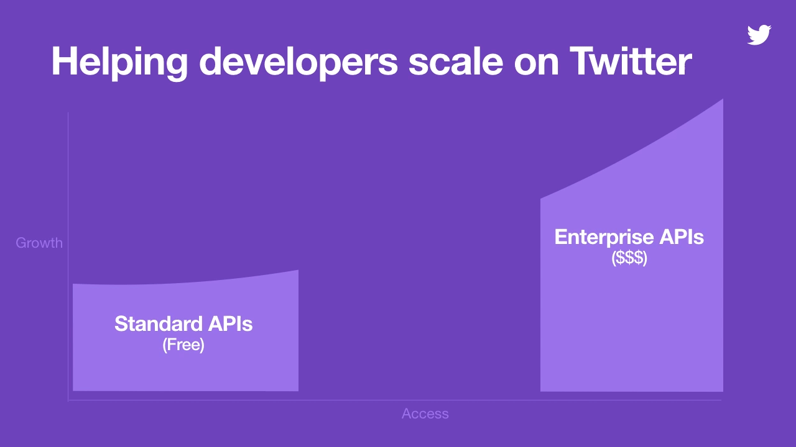
```
+ [Standard APIs](https://developer.twitter.com/en/docs/basics/getting-started#get-started-app): Free! testing, posting to Twitter and get data not available in high volumes.

+ [Premium APIs](https://developer.twitter.com/en/premium-apis.html): upgrade to scales access 

    +  more Tweets per request

    +  higher rate limits

    +  more complex queries

    +  metadata enrichments (e.g. profile geo information), etc

+ [Enterprise APIs](https://developer.twitter.com/en/docs/tutorials/twitters-enterprise-api-suite.html):
     
    +  real-time and historical social data
    
    +  customized with predictable pricing


[Twitter API documentation](https://developer.twitter.com/en/docs/accounts-and-users/subscribe-account-activity/overview): how to work with Twitter API

[Twitter Developer Lab](https://developer.twitter.com/en/labs): access to test new Twitter API products, provide feedback and get the latest news about Twitter developments

[Twitter Metrics](https://developer.twitter.com/en/docs/labs/tweet-metrics/overview)

Particular interest API endpoints:

- [GET /Tweets](https://developer.twitter.com/en/docs/labs/tweets-and-users/overview)
- [GET /Users](https://developer.twitter.com/en/docs/labs/tweets-and-users/overview)
- [Real-time streaming access](https://developer.twitter.com/en/docs/tweets/filter-realtime/guides/connecting.html)

Available APIs include REST API and Streaming API


### Facebook/Instagram

[Facebook Graph API](https://developers.facebook.com/docs/graph-api/overview/?utm_source=zapier.com&utm_medium=referral&utm_campaign=zapier): HTTP-based API to get data into/out of Facebook. 

+ The primary way of working with Facebook data

```{r echo=FALSE, out.width=600}
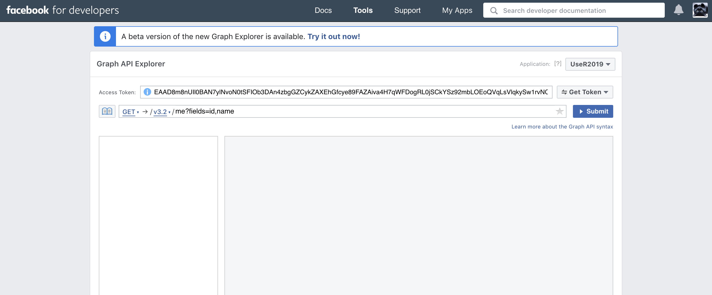
```
introduced by Facebook in May 2007
+ released in  2010 inspired from graph databases. 

*nodes* are individual objects, e.g. posts and comments

*edges* are connections between objects, e.g. comments “belonging to” a post. 

*fields* are data about an object, e.g. Page's name

+ can be used with REST API as well.


The documentation is confusing here as there are two product:

- [Instagram Graph API](https://developers.facebook.com/docs/instagram-api) (business)

- [Instagram Platform API](https://www.instagram.com/developer/?fbclid=IwAR0IMJ0vgBtaPSt-Nku61u_lLMEHqQLUTPy-WeDCkRkiKEnBny18niodjmc) (non-business, depricated)

Working with Facebook/Instagram requires approval: [App Review process](https://developers.facebook.com/docs/apps/review).

Before you start your application process, you need to have:

- An [Instagram Business Account](https://help.instagram.com/502981923235522?fbclid=IwAR31qowUhq_XsheZTPspxf5IeeW_P2h7MY8fWqW7TGgngpDyuOWzjhWpDkM) or [Instagram Creator Account](https://help.instagram.com/1158274571010880?fbclid=IwAR3KzglcALAzAVDa2dd_bICd_XlgA3dkaU0RDuPyhoVS6eao1NjdrQ-C5xk)

- [A Facebook Page connected](https://developers.facebook.com/docs/instagram-api/overview#pages) to that account. To create your Facebook developer account, you need to use your "normal" Facebook account and create a developer account [here](https://developers.facebook.com/) 

```{r echo=FALSE,fig.cap="Creating Facebook Developer account", out.width=500}
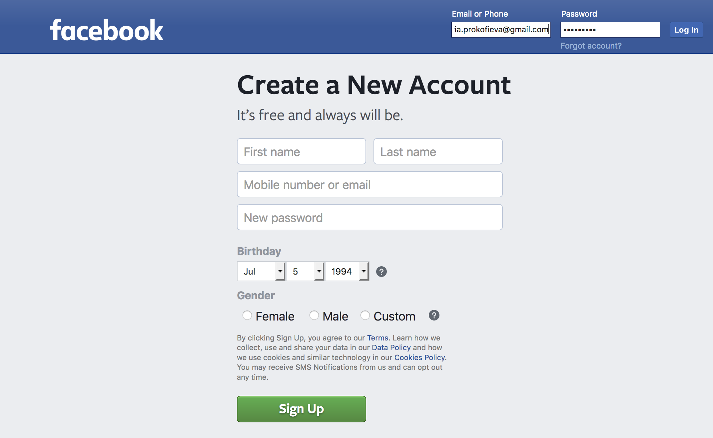
```

- A Facebook Developer account that can perform [Tasks on that Page](https://developers.facebook.com/docs/instagram-api/overview#tasks)

- A [registered Facebook App](https://developers.facebook.com/docs/apps#register) with Basic settings configured

Please note that [this guidance](https://www.instagram.com/developer/) for Instagram API is deprecated. While it may work in some instances, it is not the way that Facebook/Instagram expect developers to access data. The suggested way is to use [new Instagram Graph API](https://developers.facebook.com/products/instagram/).


#### Instagram side: Set Up and linking a Business Account on Instagram

1. Download the Instagram app smartphone / tablets / computers through the Apple iOS, Google Play, and Windows app stores. Note that some mobile features are not available / require plug-ins to work for desktops or regular web browsers.

2. if you do not have an Instagram account, create one

- Either sign up with your email address or phone number, and then enter a username, OR

- if you have a Facebook account, log in using it and link the accounts.

```{r echo=FALSE,fig.cap="Registering Instagram account", out.width=300}
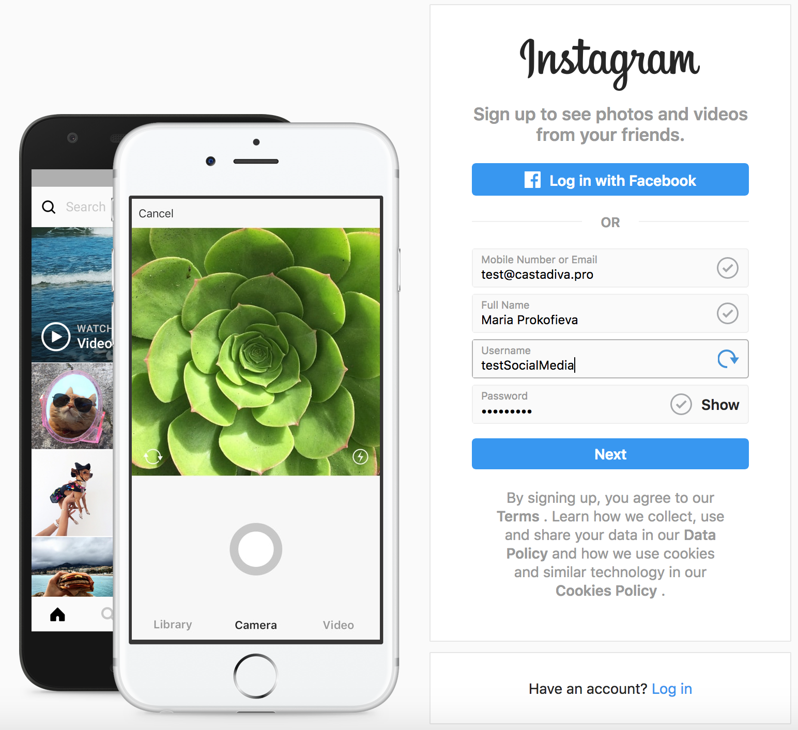
```

3. Сonvert to a Business account and connect to Facebook

Tap Settings -> Account -> Switch to Business Account.

```{r echo=FALSE,fig.cap="Switching to Business Account", out.width=150}
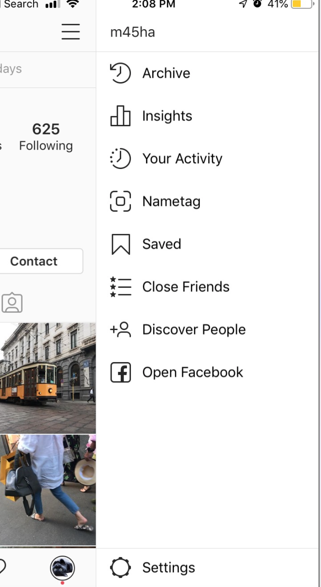
```
#### Facebook side: 

Click through the promo slideshow until you get a prompt to connect to Facebook -> Choose a page -> and set the page to “public.”

```{r echo=FALSE, out.width=150}
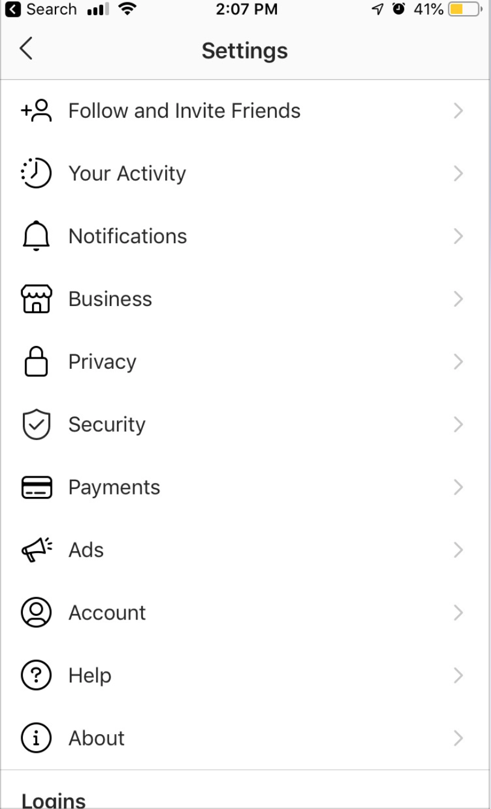
```

4. Set permissions to manage your Facebook page

Select the Facebook business page you created and make sure that you are an admin on the account, otherwise will not have access

5. Complete the profile setup and business page
Enter an email, phone number, and address for your business (at least one of them needs to be there)

A new graph icon should appear at the top of the Instagram app. This is your Insights page, where you can keep track of promotions and engagement stats.

At any time, you can go back to the profile page and switch back to a personal account.

If you haven’t already created a Facebook business page, you can do this at the same time. When you get the option to choose a page, select “Create one” at the bottom of the screen.

Set a title for your page, inncluding business category 

6. Create your Facebook developer access 

6.1. Go to developers.facebook.com and create an account there 

```{r echo=FALSE,fig.cap="Creating a new Facebook App", out.width=300}
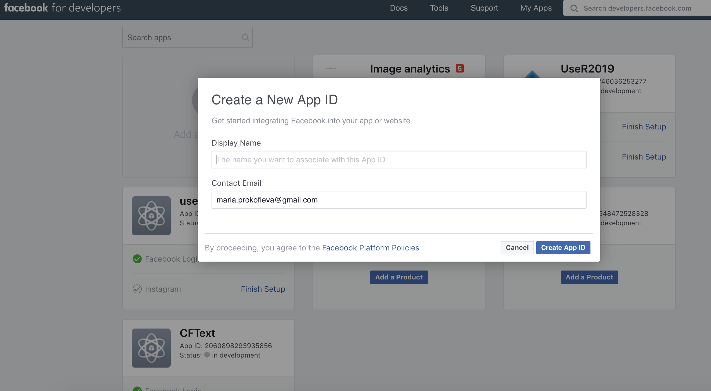
```

6.2.Configure Facebook Login

```{r echo=FALSE,fig.cap="Configure your Facebook App", out.width=300}
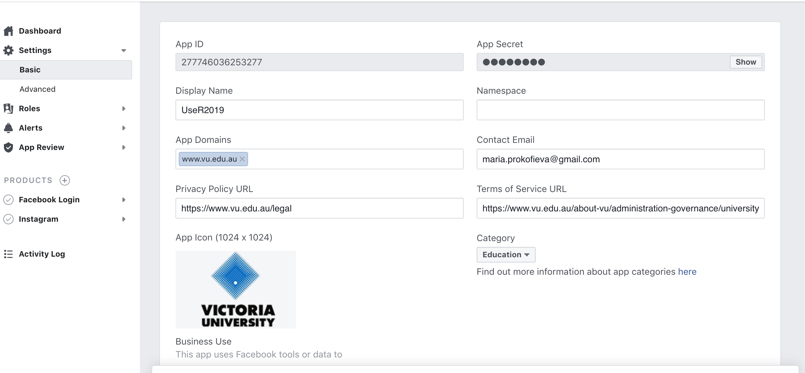
```
Add the Facebook Login product to your app in the App Dashboard.

```{r echo=FALSE,fig.cap="Configure your Facebook App", out.width=300}
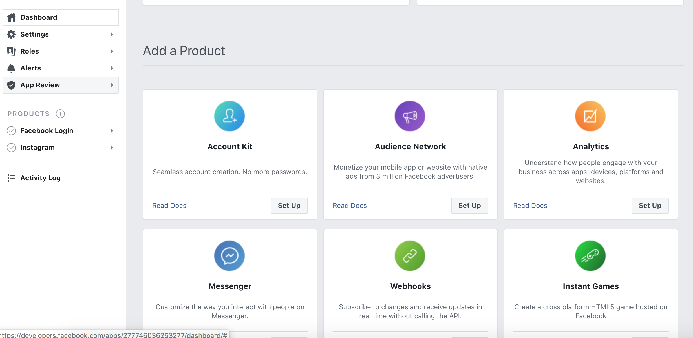
```

All settings can be left as defaults. Set You can leave all settings on their defaults. Redirect_uri in the Valid OAuth redirect URIs field

App ID: a unique App ID for your app that is included when making any calls to Facebook/Twitter APIs. 

Platform: how your users access your app (e.g R is a server-side application.

Privacy Policy and Terms of Service: URL to a privacy policy and terms of service that apply to your app's users. Lots os online resources to generate a simple one for [free](https://www.freeprivacypolicy.com)

Development Mode: initially your app is in the development mode. It limits app access to users who have a role on your app. You need to do all  of your development and testing in development mode, before you submit your application for review. Note: there is no separate review process for individual products (=platforms )

Important that in development mode your app:

- can use all permissions, features, and products
- can only be installed / used by users who have a role on your app
- can only be granted permissions by users who have a role on your app
- can only access User, Page, or Group data from users who have a role on your app, or data from Test Users and Test Pages.

```{r echo=FALSE,out.width=300}
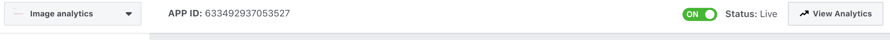
```

6.3. Implement Facebook Login

Set up your implementation to request these permissions:

[instagram_basic](https://developers.facebook.com/docs/apps/review/login-permissions#instagram-basic)
[pages_show_list] (https://developers.facebook.com/docs/apps/review/login-permissions#pages-show-list)

Now let's have a look what we can do with data from the Instagram. While the actual application requires passing the approval process, we are going to perform preliminary work in R using Instagram Graph API.

Example of screencast:


### Google/YouTube

Not all services are free, but great flexibility:

+ [Google Cloud Platform Education Grants](https://edu.google.com/programs/faculty/?modal_active=none) 

If you do not have a Google account, you can create one at https://www.google.com/accounts/NewAccount 

1. Go to the Google Developers Console https://console.developers.google.com/ and create a project there

```{r echo=FALSE, out.width=500}
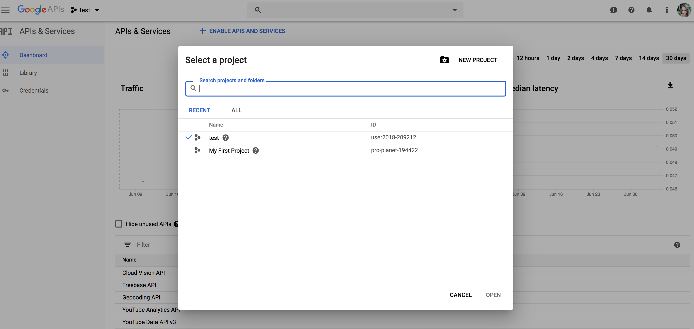
```

2. Enable YouTube APIs:

```{r echo=FALSE, out.width=500}
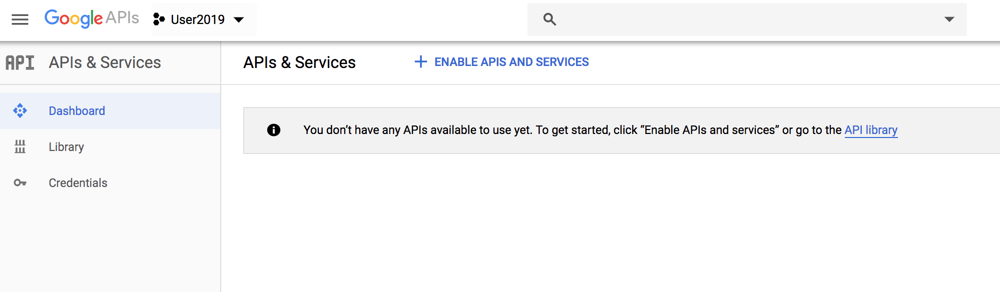
```

You need to enable the following APIs YouTube Data API is one of the services that your application is registered to use:

```{r echo=FALSE,out.width=500}
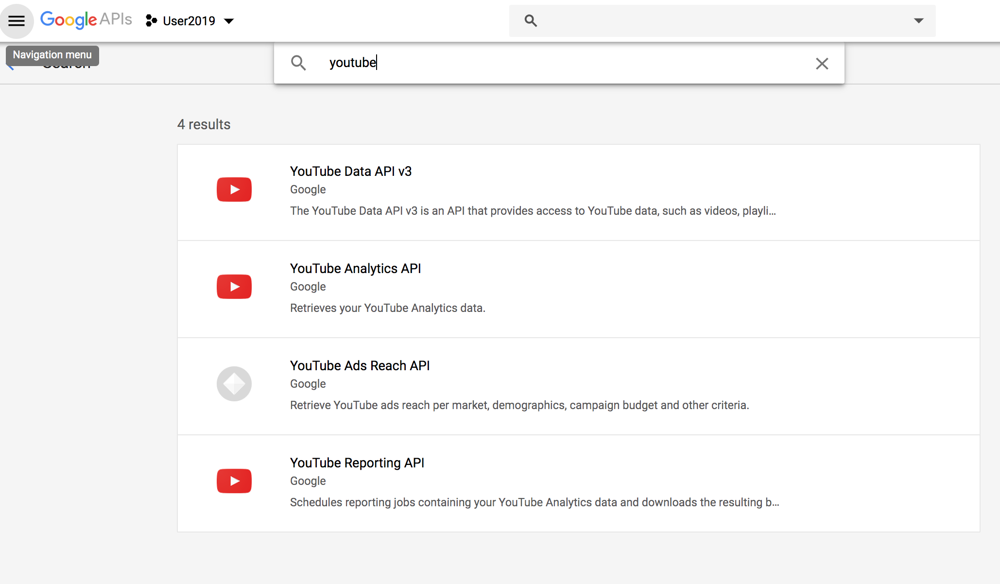
```

In the list of APIs, make sure the status is ON for the YouTube Data API v3.

```{r echo=FALSE,out.width=500}
knitr::include_graphics("images/Youtube4.png")
```

To use YouTube data API you need to have authorization credentials. 
The API supports API keys and OAuth 2.0 credentials. 

The tuber package uses OAuth 2.0, but you will also need the API keys for some data extraction, e.g. obtaining YouTube channel ID. 

To set up your credentials, you go to the Credentials section in your Google Developers Console. 

For the OAuth 2.0 setup, set “Authorized redirect URIs” as  http://localhost:1410/

Note down the following:

1. Your API key

2. OAuth 2.0 credentials:

Name: useR2019
Client ID:
Client secret:
## R Packages to work with social media

R Packages to work with REST APIs:


## Working with social media data

Features of social media data

+ "ustructured" data: high-dimensional, attribute-value data.

Examples: posts, tweets, comments, and images

+ "linked" data that describes the relationships between social media users and their postings.

**Typical workflow:** 

+ Get your data: social media platforms, application approval may be required!

+ Preparation and cleaning
+ Segmentation
+ Tokenization
+ Stop-word numbers and punctuation removal
+ Convert to lowercase
+ Converting to a "structured" form

    + Option 1 - tf df matrix:
    + Option 2 - tibble
    
+ See [tidy-text approach](https://www.tidytextmining.com/tidytext.html)*

*Keep or remove?*
Data mining preceeds text analytics and refers to cleaning and data preparation: transformation of the unstructured text into a structured data, e.g. tf-idf matrix. But.. is it all noise?

- Text extraction and removal of web-specific elements

- stop-word removal: commonly occurring words with little discriminative power

### The power of emojies 

Textual paralanguage - Great, Umm, *Eyeroll*
Paralanguage (paralinguistics) is a component of meta-communication that may modify meaning, give nuanced meaning, or convey emotion

Textual paralanguage signals informality of the communication and has negative affect on perceptions of brand (company) competence. But when it is used by a brands spokescharacter, there is no negative effects as such communication is already perceived as informal.

### Emojis

```{r echo=FALSE, out.width=300}
knitr::include_graphics("images/emojis.png")
```

Emojis are ideograms and smileys used in electronic messages and web pages. Twitter now supports 1100+ emoji and develops its own project, [Twemoji](https://github.com/twitter/twemoji), that supports 3,075 emojis

[Emojitracker](http://emojitracker.com/) monitors the use of emojis on Twitter in realtime. 
)

```{r echo=FALSE, out.width=300}
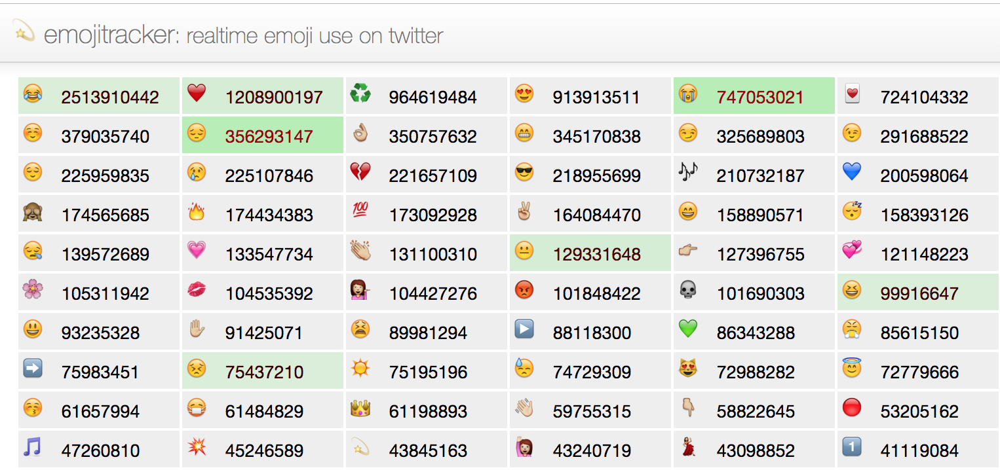
```

Traditionally thought of as a ultimate elevator pitch for [business promotion](https://business.twitter.com/en/blog/5-ways-to-increase-your-tweet-engagements-with-emojis.html).

[AirBnb project]( https://christinequan.github.io/airtweets/) : "Describe your dream trip in 3 emojis"

```{r echo=FALSE, out.width=300}
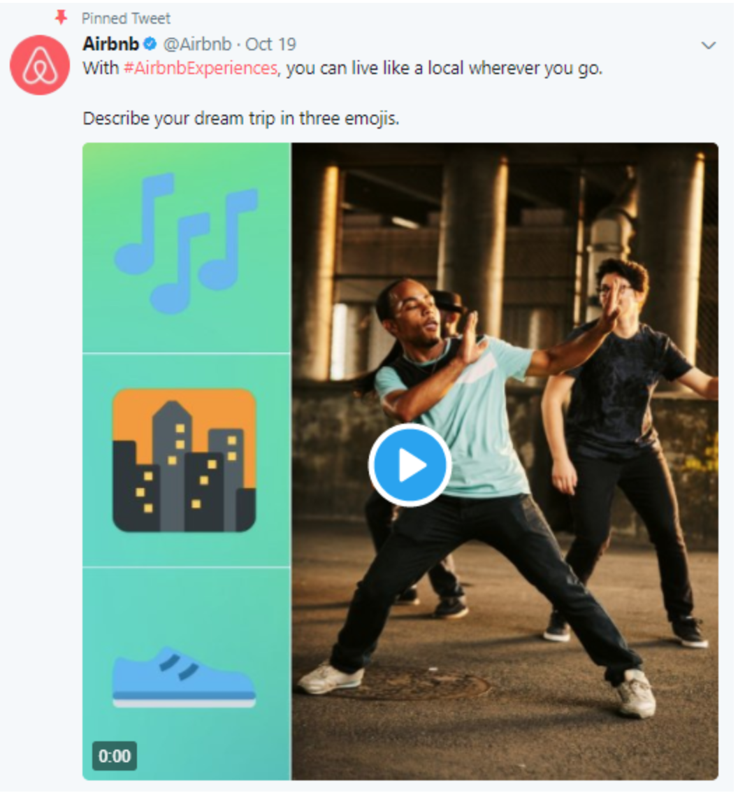
```

```{r, echo=TRUE, error=FALSE, warning=FALSE, message=FALSE, eval=FALSE}
library(emo)
emo::ji("heart")
emo::ji("ghost")
emoji <- data %>%
  mutate( 
    emoji = ji_extract_all(text)
  ) %>%
  select(screen_name,emoji, text, created_at) %>% 
  unnest(emoji) 
knitr::kable(emoji[1:5,1:3], caption = 'Sample of emojis')
``` 

How-to:

- extract emojis from tweets, use `stringr` 
- use a dictionary to translate emojis - the "full" list of emojis are available [here](https://github.com/iamcal/emoji-data/blob/master/categories.json)
- [categorise](https://emojipedia.org/) emojis - json file [here](https://github.com/iamcal/emoji-data/blob/master/categories.json)

Read the emoji dictionary

```{r, echo=TRUE, error=FALSE, warning=FALSE, message=FALSE, eval=FALSE}
library(jsonlite)
emoji_data <- fromJSON("data/emoji.json")
emoji_cat <- fromJSON("data/categories.json")
``` 

or

`emojis.csv` thanks to [Jessica Peterka-Bonetta] (http://opiateforthemass.es/articles/emoticons-in-R/)

```{r, echo=TRUE, error=FALSE, warning=FALSE, message=FALSE, eval=FALSE}
emoji_dic <- read.csv2("data/emojis.csv") %>% 
  select(EN, ftu8, unicode) %>% 
  rename(description = EN, r.encoding = ftu8)
```
```{r, echo=TRUE, error=FALSE, warning=FALSE, message=FALSE, eval=FALSE}
knitr::kable(emoji_dic[1:5,], caption = 'Sample of emojis dictionary')
```

Once the matching was done everything else was like a breeze!

From this we can rank emojis by occurence in data


## Text analysis 

**Text analytics** refers to applying statistical and machine learning techniques to extract useful insights from text 

The focus of my research is the use of text analytics for social media data. Businesses are excessively pressed for the need to engage with social media and explore its potential for stakeholders engagement, e.g. customers, shareholders. Companies target to monitor the social media space to understand customers' changes preferences, comptetitors offers, market trends, investors' sentiment.

```{r echo=FALSE, out.width=600, fig.cap="Text is messy, but tweets are messier! From https://blog.twitter.com"}
knitr::include_graphics("images/twitter_language.png")
```

Basics:

**Bag of Word**: way of representing text data
 dimensions are words, values are their frequences
- most commonly used representation for text mining

- the ordering of words is lost

- text is converted to a sparse multidimensional representation: the universe of words (or terms) are dimensions (or features) 

- *Application*: classification, topic-modeling, and recommender systems

```{r echo=FALSE}
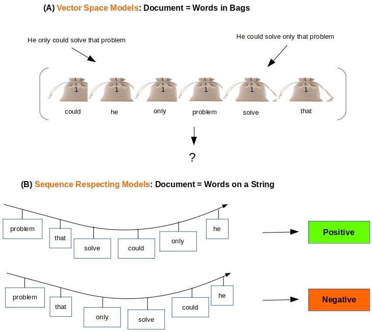
```

**Sequential representation** of text:

- the ordering is preserved: localized within sentence or paragraph boundaries

- text is a collection of smaller units, e.g. sentences, paragraphs 

- individual sentences are extracted as strings or sequences. 

- *Application*: language modeling, natural language processing

**Bag-of-words (BoW) vs sequential representation (SR)**: 
- Data-centric aspects: 
    - length of the text: small for SR, longer for BoW

- Application-centric aspects:
    - method requires to treat sentences as sentences -> SR, e.g. text summarization, information extraction, opinion mining, and question answering

**Tidy text**: "long" format where information is stored in “a table with one-token-per-row”:

- each variable is a column

- each observation is a row

- each type of observational unit is a table

**Token**: smallest unit of the text, e.g. words within a sentence, sentence within a text.

*Which token?*
a sentence, word, n-gram, morpheme, letter

**Term-document-matrix** (= document-feature matrix)

- statistical measure that shows importance of a word is in  a document in a collection of documents (corpus)

- the more times a word is used in a document, the higher the importance, but also how often a word appears in the corpus.

**Corpus**: a data set = collection of documents


*Lexicon*: collection of words and their meanings, complete and distinct set of words used to define the corpus

*TF = Term Frequency*: 
TF(t) = (Number of times term t appears in a document) / (Total number of terms in the document).

*IDF = Inverse Document Frequency*:
IDF(t) = log(Total number of documents / Number of documents with term t in it)

*Tf-idf* = TF * IDF

Tf-idf matrix:

- High-dimensional, sparse, and non-negative representation

- Dimensions: binary representation: 1 = the presence of a term in a document, 0, otherwise. 
most values of the dimensions are 0s, and only a few dimensions take on positive values

-Multidimensionality and sparseness of the data:
    - Number of words -> dimensions of data
    - Most word frequences are zero

**Language Modeling**: probabilistic models that are able to predict the next word in the sequence given the words that precede it.

Uses: Machine Translation, spell Correction, speech Recognition, summarization, question answering, sentiment analysis etc.

Depends on 
- tasks
- their specification
- heuristics
- preconditions


### R Packages

- `tidytext`: [0.2.1 version](https://cran.r-project.org/package=tidytext) 
    - new plotting functions
    - tokenizer for tweets
    - unnest_token has extra arguments for "tweets": `strip_punct` and `strip_url`.

-  `textdata`: `tidytext` uses it to access [lexicons](https://github.com/EmilHvitfeldt/textdata). Bing Liu lexicon (tidytext), AFINN (textdata), NRC lexicon (N/A)

*Changes*: licensing is fixed and the user needs to agree to dataset’s license/terms of use.

- `quanteda`: by Kenneth Benoit et al. for textual data management and analysis

## Current developments

[Twitter academic researchers](https://developer.twitter.com/en/academic-researchers?utm_source=twitter%20dev%20organic%20tweet&utm_medium=twitter%20dev%20organic%20tweet&utm_campaign=twitter%20dev%20organic%20tweet): Register as an academic to participate in their feedback program


[UserVoice channel for academic researchers](https://twitterdevfeedback.uservoice.com/forums/922918-twitter-for-academic-research): current "hot ideas" for academic feedback, including

+ [Extend Historical Data For Academics](https://twitterdevfeedback.uservoice.com/forums/922918-twitter-for-academic-research/suggestions/38168590-extend-historical-data-for-academics)

+ [Raise Rate Limits For Academics](https://twitterdevfeedback.uservoice.com/forums/922918-twitter-for-academic-research/suggestions/38168617-raise-rate-limits-for-academics)


[Social Science One Facebook partnership](https://socialscience.one/our-facebook-partnership)

Focus: the effect of social media on democracy and elections, with access to Facebook data.

Includes:

- Facebook provides (privacy-preserving) data access

- 8 charitable foundations provide funding

- SocialScience.On (an organization of academics) leads the project

- the Institute for Quantitative Social Science (Harvard) and the Social Science Research Council provide logistical help.


## Resources
* Twitter
    +  [Twitter Developer](https://developer.twitter.com/en/docs/accounts-and-users/subscribe-account-activity/FAQ.html)
    + [Setting API for rtweet](https://rtweet.info/articles/auth.html)
    + [Twitter API Explorer]()

* Facebook/Instagram
    +  [Facebook Developer](https://developers.facebook.com/)
    +  [Instagram Graph API](https://developers.facebook.com/docs/instagram-api)
    +  [Facebook API Explorer](https://developers.facebook.com/tools/explorer/)

* YouTube 
- [Google Developer](https://developers.google.com/)
- [Google API](https://developers.google.com/youtube/documentation/)
- [Google API Explorer] (https://developers.google.com/apis-explorer/#p/)